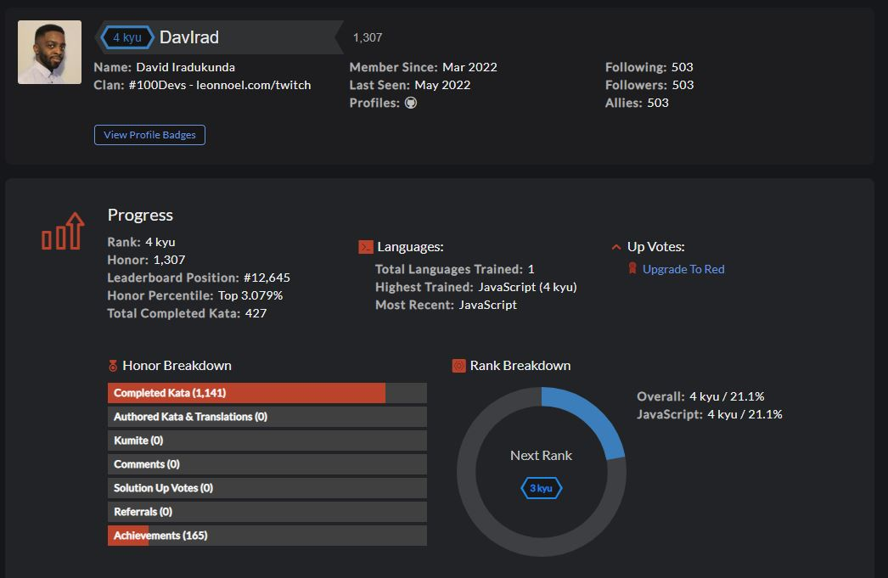

# CodeWars Challenges: <a href="https://www.codewars.com/users/DavIrad">Visit Here<a>

  
A repository filled with codewars challenges (kata). Currently Ranked #1305 on the global leaderboard, Completed over 1000+ challenges and Push 5 solutions every week.

## How It's Made:

**Tech used:** 

Everyday, the first thing I do is solve a Codewar!

## Optimizations

I consistently refactor and optimize my code, sometimes for efficiency, sometimes for readability.

## Lessons Learned:

The Biggest Lesson I learned in tackling this endless supply of questions is understanding that there is a long way to go. Not being able to answer a question is okay, as long as you take the initiative to improve.
